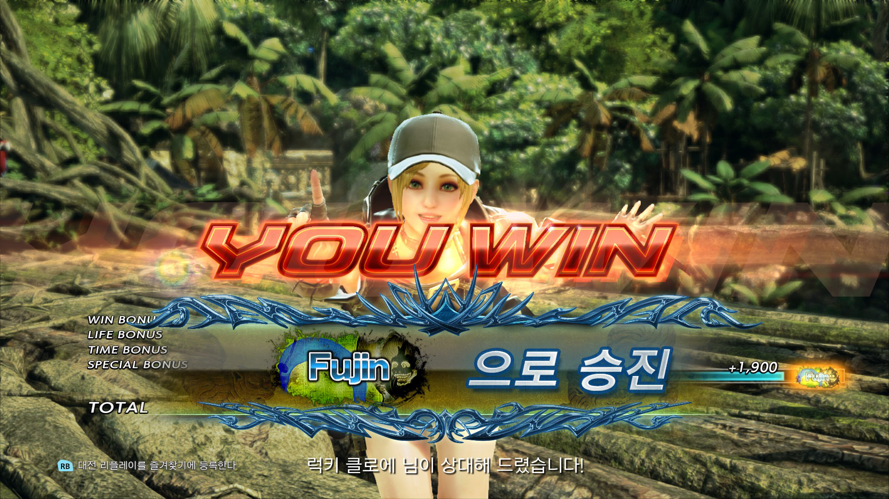

2024년 1월 26일 철권 8이 출시를 해서 해봤다. 리뷰를 하기에는 스토리 모드를 열심히 할 생각이 없기도 하고 격투게임은 어차피 할사람들이 하는 게임이다보니 그냥 내가 플레이 했던 일기를 남겨본다.

일단 개인적인 이유로 게임할 시간이 너무 부족해졌다. 오랜 백수 기간이 끝나고 출근을 시작해서... 또 출퇴근에 시간이 오래 걸리다보니 진짜 뭐 할 시간이 더더더 없다.

아무튼 어제(27일) 오늘(28일) 주말 기념 철권을 좀 했다. 철권 시리즈는 이전에 가끔 잡아봤지만 제대로 한 입문은 군대에서 7로 처음 했다. 가끔 생각날 때마다 열심히 하기도 하면서 럭키 클로에로 세기말에 푸진까지 찍었었다. 

()

예상은 했지만, 7에서 주캐였던 럭키 클로에서 8의 시작 캐릭터에 없어서 주캐로 삼을 캐릭터를 고민했다. 에디도 생각 중이긴 한데 봄에 나올 예정이니 그 전에 계속 고민중이다.

아무튼 이것 저것 해보면서 연습모드에서 모든 캐릭터의 콤보 챌린지를 다 해봤다. 이것 저것 해보다가 결국 아수세나로 하기로 결정했다.

콤보 하나 깎아보고 대충 여러 기술 써보면서 아케이드 모드를 돌아봤다. 아케이드 모드에서 닉네임 달고 나오는 캐릭터들이 있던데 이게 그 고스트들로 나오는 건지 습관같은 게 좀 보였다.

랭크전을 돌려서 사람이랑 해봐야지 좀 더 재밌게 즐기고 잘 할 수 있게 되겠지만 너무 피곤해서 언제 다시 제대로 할지는 모르겠다. 예전엔 캐릭터 매뉴얼 같은 것도 찾아보고 콤보 루트도 연구하면서 열심히 했었는데 그럴 체력도 시간도 정신도 없어졌다는 게 좀 슬프다.

아무튼 좀 여유가 생기면 열심히 달려봐야겠다.