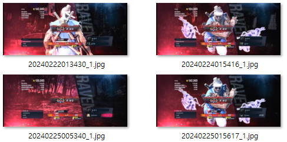

안녕하십니까 여러분. 김종격입니다.

게임 블로그를 하겠다고 야심차게 만들어두고 삼주나 방치하고 있었습니다. 그런데 어쩔 수 없습니다. 왜냐? 게임 할 시간도 부족한데 포스트를 올릴 시간은 더욱 없거든요. 현생이 바쁘다는 뜻입니다.

# 철권8을 합니다.

그나마 틈틈이 할 만한 게임으로 철권을 하고있습니다. 이전 [포스트]()에서 아수세나 (아직 Azucena를 아수세나로 읽는 게 맞는지 아주세나로 읽는 게 맞는지 잘 모르겠음) 녹단을 달았다고 했는데, 주캐를 레이븐으로 바꿨습니다.

주캐를 바꾼이유는 단순히 저의 힙스터 기질 떄문입니다. 아수세나가 더 좋은 것 같기는 한데, 다른 사람들이 너무 많이해서... 버리지 못하는 힙스터 기질... 남이 잘 모르는 캐릭터로 이기고싶은 욕망... 그런 것 때문에 주캐를 바꿨습니다.

틈틈이 하면서 빨강단까지는 올렸는데, 자꾸 Garyu 단에서 미끄러지기를 반복하는 중입니다. 날먹이 슬슬 안 통하면서 좀 진득하니 연습 모드에서 콤보도 더 깎고, 다른 캐릭터들 상대로 딜캐 연습도 하면서 연구를 해야하는 단계가 왔는데, 초기에 말한대로 시간이 안 나다보니 엄두가 잘 안 나네요.

저번 2월 20일에 철권 로드맵 발표하면서 공개한 에디를 보니 꽤 괜찮아 보이더군요. 에디 출시된 이후로는 에디로 플레이해볼 생각입니다.

# 쿠키런: 오븐브레이크도 합니다.

10여년 전 카카오 쿠키런을 플레이 하던 시절엔 2024년까지도 쿠키런을 잡고 있을 줄 몰랐습니다.

예전처럼 많은 시간을 투자해서 하지는 못하지만, 출퇴근길에 할만한 게임으로 쿠키런만한 게 없어서 계속 하고있습니다.

물론 요즘은 대충 길드전만 돌고 대부분 랜덤 떼탈출만 하고 있어요.

# 하고 싶은 것만 많아서

팰월드도 한번 해보고 싶고, 발더스 게이트 3도 다회차 플레이를 하고 싶고, 페르소나 3 리로드도 엔딩까지 달리고 싶은데 시간이 안 나네요.

흑흑..
