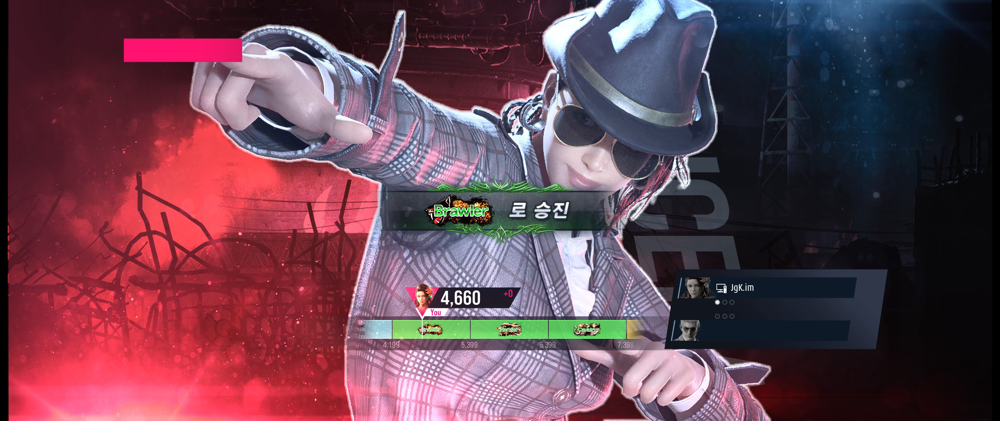
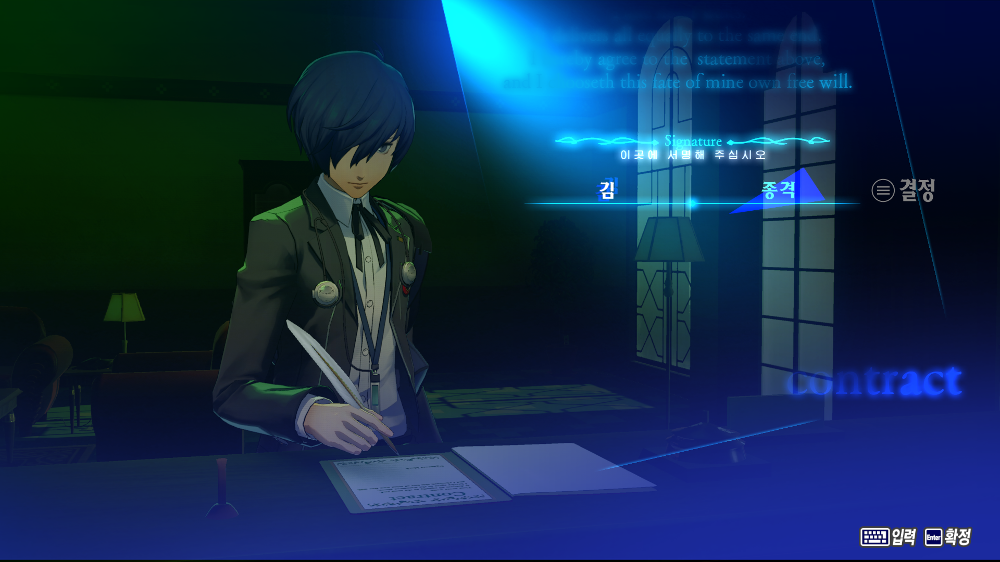
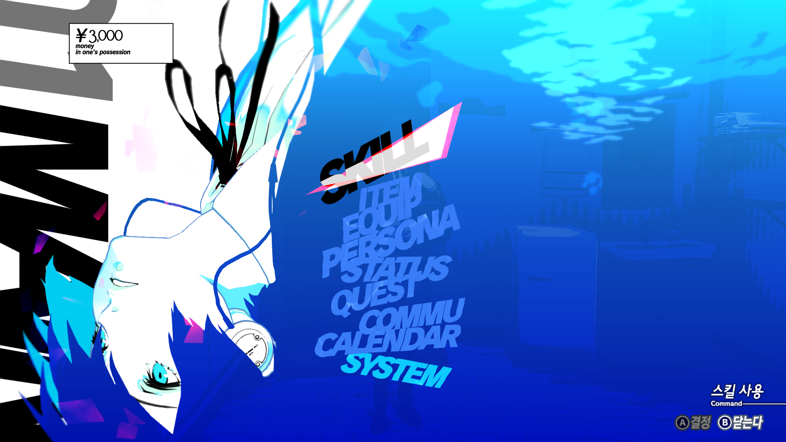

2024년 2월 첫주 개인적인 게임 일기

# 철권 8, 아수세나 녹단 달성

이번 주에 철권 조금씩 하면서 녹단까지 올렸다. 철권 7 세기말에 푸진까지는 찍어서 금방 올릴 수 있을 거라 생각했는데 그 생각보다는 올라가는 데 시간이 더 걸리고 있다.

좀 침착하게 하면 금방 올라갈 수도 있을 것 같은데, 철권 8이 되면서 전체적으로 공격력이 올라가서 그런지 날먹을 한 번 당할 때 순식간에 패배해버리고, 파훼하기 전에 2선승이 끝나버려서 조금 어려운 것 같다.
주변에 같이 하는 친구들을 좀 더 구해서 10선승 플레이어 매치를 좀 돌려보면서 연습을 더 하는 게 좋을 것 같다.

빨리 시즌 추가 캐릭터인 에디가 나왔으면 좋겠다. 아니면 빨리 럭키 클로에를 추가해주던가.

# 페르소나 3: 리로드 시작

페르소나 3의 리메이크 작인 리로드가 출시해서 플레이해봤다. 페르소나 시리즈는 5로 처음 해보고 한 번 엔딩 본게 다지만, 그래도 재밌다고 생각했다.

작년(2023년)말에는 페르소나 4 골든을 구매해서 플레이하기 시작했다. 물론 시간도 좀 부족하고, 그 시간에 주로 데이브 더 다이버나 발더스 게이트 3을 더 많이해서 몇 시간 못했다.

페르소나 3 리로드라는 제목을 보고서 막연히 그냥 단순한 PC 이식작이라고 생각했기에, 처음 켰을 때 좀 충격적이었다. 페르소나 4 골든의 PC 이식작 정도의 그래픽 수준을 기대하고 켰는데, 페르소나 5보다 뛰어나게 느껴지는 그래픽과 UI가 날 맞이했다.

특히 이 스크린샷의 UI. 페르소나 5의 붉은 계열과 대비되면서도 페르소나 5 특유의 정돈되지 않은 듯한 분위기를 풍기는 이 UI가 마음을 사로잡았다.

틈틈이 플레이해보고 나중에 리뷰를 써 봐야겠다.

# 리그 오브 레전드, 스몰더 출시

이번에 리그 오브 레전드에 신규 챔피언 스몰더가 나왔다. 솔로 랭크 게임은 거의 하지 않지만, 친구들과 5인 파티로는 종종 플레이하다보니 이번에도 친구들과 함께 플레이해봤다.

조작 난이도가 크게 어렵지도 않고, 스킬들도 굉장히 직관적으로 잘 나온 것 같다.

수정하긴 했음에도 불구하고 스몰더의 얼굴과 몸이 잘 매칭되지 않아서 이상하다는 디자인적인 단점과, 스택이 쌓이기 전 초반이 너무 약하다는 게 좀 문제지만, 패시브 225스택을 쌓고 나서부터는 강하고 재밌었다.

팀의 고혈을 빨아먹고, 재미가 생길 정도로 세지면 한타 한 번에 게임이 끝나는 후반이 되어 재미있는 시간이 짧은 것도 문제지만, 뭐 친구들이랑 같이 하기엔 꽤 괜찮은 것 같았다.