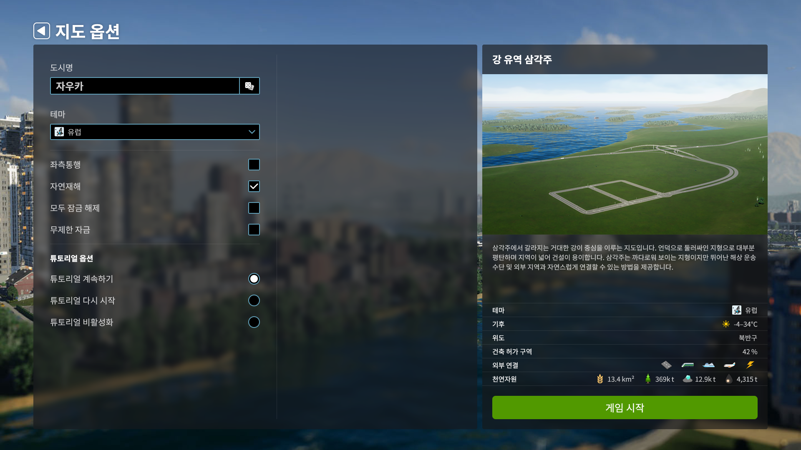
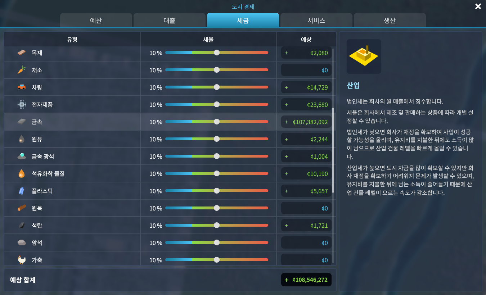

> 시티즈: 스카이라인 1을 나름 재밌게해서 2를 기대했지만, 평이 너무 안 좋아서 플레이를 안 하고 있었다. 그런데 게임패스 목록에 있길래 해보고 직접 평가해보자는 생각으로 플레이해봤다.

| 제목                | 제작           | 배급                | 출시일           | 플랫폼 |
| ------------------- | -------------- | ------------------- | ---------------- | ------ |
| Cities: Skylines II | Colossal Order | Paradox Interactive | 2023년 10월 24일 | PC     |

_PC(Game Pass)에서 약 8시간 플레이 후 리뷰 작성_

# 도시 경영 시뮬레이션

나는 경영 시뮬레이션 게임을 좋아한다. 초등학생 시절, 롤러코스터타이쿤과 심시티 시리즈를 플레이했던 게 이 취향을 만들어낸 것 같다. 문제는 롤러코스터타이쿤도 심시티도 그 시절 이후에 마땅히 괜찮은 게임이 나오지 않았다는 것이다. 경영 게임을 하고 싶을 때가 있는데 딱히 할만 한 게 별로 없었다.

그러던 중 2015년에 출시했던 *시티즈: 스카이라인*은 가뭄의 단비같은 게임이었다. 처음 나왔을 때는 ~~심시티보다는 훨씬 나았지만~~ 약간 부족한 느낌이 있었지만, 추후 DLC와 여러 모드들로 인해서 거의 완벽에 가까운 도시 경영 시뮬레이션 게임이 되었다.

시간이 지나 출시한 지 거의 10년이 다 되어가는 게임이 될 때 쯤, 후속작이 나온다는 소식이 들려왔고, 자연스레 기대감을 가졌다. 가끔 전작인 *시티즈: 스카이라인*을 플레이하며 2편을 기다리다가 2023년 10월 말, 마침내 게임이 출시되었다.

게임 출시 직후에 바로 구매해서 플레이할 생각이었지만, 평가가 바닥을 쳤다. 백수였던지라 바닥을 기는 평가에 선뜻 돈을 내서 플레이할 수 없어서 재밌게 했던 게임의 후속작임에도 구매를 못 하고있었다. 며칠 전 Xbox 게임 패스를 결제하고 보니 게임 패스 게임에 이 *시티즈: 스카이라인 II*가 있어 왜 그렇게 평가가 안 좋았는지 궁금해진 김에 플레이해봤다.

# 짧은 플레이, 많은 문제

8시간이라는 시뮬레이션 게임치고는 짧게 플레이 했지만, 많이 답답했다.

## 최적화

일단 소문으로 많이 듣던 최적화 문제가 조금 있었다. 그래도 패치를 해서 그랬는지 프레임이 조금 떨어지는 것 이외에는 크게 신경쓰이지 않아서 그냥 옵션을 낮게 낮춰서 플레이했다. 인구 수가 10,000명을 넘어서니 낮은 옵션에서도 프레임이 떨어지기 시작하긴 했지만 원래 이런 도시 경영 게임 자체가 무거운 게임이니 이정도의 문제는 그럭저럭 넘어갈 수 있었다.

## 번역

문제는 여기서부터 발생한다. 게임 도중에 번역이 안 되어있는 경우가 종종 발견되었다. 아니, 번역이 안 되어있어서 영어로 표기되는 건 이해할 수 있지만 아래 스크린샷처럼 일본어가 나오는 경우도 있었다. 도대체 왜?

이게 스팀판에서도 똑같은 문제가 일어나는지는 확인이 안 되어서 게임패스 판에서만 일어나는 문제인지, 게임 자체의 문제인지는 잘 모르겠지만 불쾌한 경험이었다.

, 일본어 번역이 나오는 경우도 있었다(아래 이미지).")

## 여러분제가돈무한버그를알아냈습니다이글을복사하여다른세곳에붙여넣고새로고침을하면돈이9999999999으로됩니다.

이런 류의 경영 시뮬레이션 게임의 재미와 난이도는 돈에서 나온다. 도시에 문제가 생기면 그걸 해결하면서 도시를 키워나가는 게 게임의 메인 목적인데, 여러가지 인프라를 미리 깔아버리면 돈이 부족해 도시 발전을 더 할 수 없게 되니 적절히 관리해 흑자를 보면서 도시를 키워나가는 게 게임의 재미인 것이다.

따라서 이 돈을 벌긴 하되 너무 많지 않게 적당한 난이도를 조절해 두는 게 게임의 재미다. 물론 무한한 자원으로 잘 돌아가는 도시를 꾸미고 키워나가는 재미로 플레이를 할 수도 있지만, 그런 걸 하고 싶으면 보통 샌드박스 모드(*시티즈: 스카이라인 2*에서는 자원 무제한과 모두 잠금 해제를 지원한다.)로 플레이를 하지 일반적으로는 돈 제한이 있기 마련이다.

그런데, 게임을 하던 중 갑자기 엄청난 적자를 봤다. 게임에서 수입 통계를 볼 수 있는 화면을 지원하여 어디서 적자가 심하게 나는 지 확인을 해봤더니, 갑자기 금속 산업에서 엄청난 손해를 보고 있었다. 받는 세율을 -10%로 바꾸니 그 손해가 갑자기 엄청난 이득으로 바뀌었다. 시간이 좀 지나자 손해가 또 생겨 보니 금속 산업이 이제는 엄청난 이익을 보고있었다.

그 금액이 적당히 상식선에서 일어났다면 그냥 넘어갔겠지만, 다른 산업 카테고리에서 벌어들이는 금액보다 만배 더 높은 금액에 버그라는 사실을 알게되었다. 사실상의 돈 무한 버그와 같은 일이 일어난 것이다.

최적화나 번역 문제는 사소하게 신경쓰이는 문제였지만 이 돈이 무한정 불어나는 버그는 게임의 재미를 크게 해쳐 저 버그가 일어나고 나니 게임에 대한 흥미가 식었다. 아마 여러 문제가 해결 되거나 DLC가 출시되어 바뀌기 전까지는 플레이 하지 않을 것 같다.

## 기타 사소한 단점들

그 외에도 사소하게 불편하거나 거슬렸던 점들이 몇 가지 있었다.

* 약간 불편한 도로 설치 시 커서 스냅   
  그래도 1편 때보단 나아졌다.
* 크기가 과도하게 큰 일부 시설들
* 변경된 건물 해금 방식    
  1편에서는 인구수에 따라 자동으로 해금 되었는데, 이번에는 경험치에 따라 도시 등급이 오르는 방식으로 바뀌었다. 그리고 등급이 오를 때 포인트 같은 걸 받아 추가적으로 특화 건물을 해금할 수 있다. 여기에서 두가지 문제점을 느꼈다.
  1. 경험치 수급   
     인구가 늘고, 도시 행복도가 높으면 경험치를 얻는다. 이는 전작에서도 인구수에 따라 해금되니 어느정도 이해되는 부분이다. 추가적으로 건물이나 시설을 지으면 경험치가 오르는데, 여기서 건물을 지을 때 경험치를 얻지만 해당 건물을 부수면 경험치가 떨어지지는 않는다는 것이다. 그래서 한 건물을 짓고 부수는 걸 반복하면 도시 등급이 빠르게 오른다.
  2. 일괄 해금이 아님
     앞서 말했다시피 특화 건물들은 따로 해금 할 수 있게 되어있다. 도시를 특화할 수 있다는 점에서 괜찮은데 처음하는 입장에서는 멋모르고 올렸던 건물이 필요 없는 경우에 무를 수도 없고 필요한 건물을 올릴 수 없게되니 조금 어려웠다. 큰 단점이라기보단 처음 진입 장벽이 생기는 정도이고, 게임에 익숙해지면 오히려 재미요소가 될 것 같긴 했다.

# 그래도 장점은 있잖아

그래도 전작과 대비해서 괜찮아진 부분들도 많이 있다.

우선 전기와 수도가 도로와 연결되었다. *심시티(2013)*에서는 적용 되었지만 전작에서는 없어 따로 전기와 수도를 연결해주었어야 했는데, 이제 도로에 수도와 전기가 자동으로 연결되어 관리가 좀 편해졌다.

그리고 도로 건설이 전작보다는 편해졌다. 그래도 약간 불편한 감이 있기는 하지만, Move It 같은 모드가 필수적이었던 전작보다는 훨씬 나아졌다. 또 여러 교통 시설들에 대한 설정을 좀 더 세부적으로 할 수 있어서 좋았다.

게임 자체가 주는 재미가 떨어지는 건 아니라서 좀 짜증나도 계속해서 플레이 하게됐다. 진짜 재미없는 게임은 아니다.

# 결론

이 게임도 결국 우선 발매하고, 나중에 완성하는 게임으로 나오게 된 것 같다. 몇 년 후에 DLC나 패치 등으로 더 완성되고 나면 재밌게 플레이 할 수 있을 것 같다. 요즘 게임들이 너무 미완성으로 발매되는 것 같아서 좀 아쉽다.
