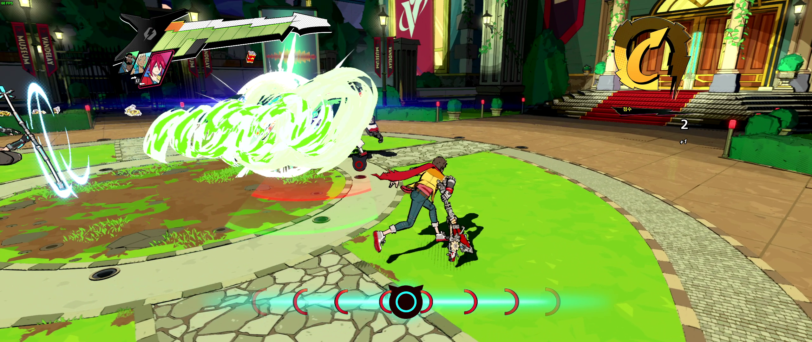
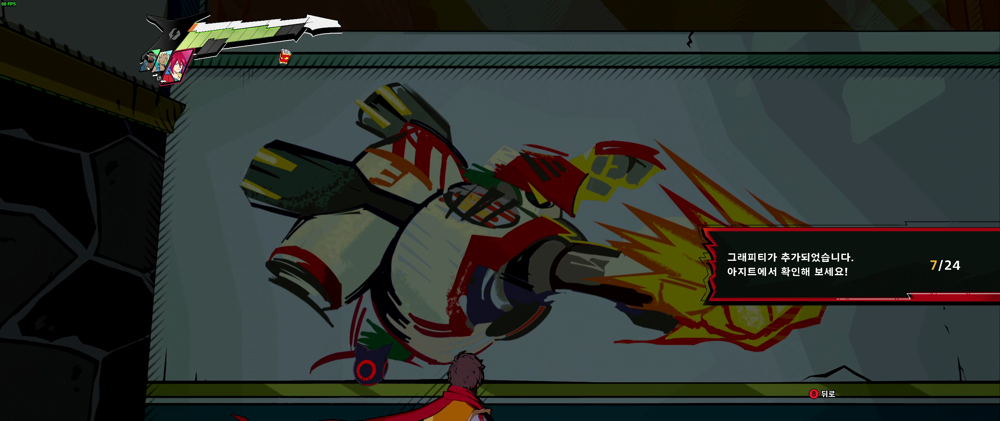
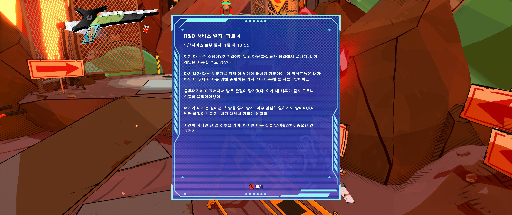

> 게임 블로그를 만들고자 마음 먹고 첫 리뷰 대상을 고민하며 여러 게임들을 플레이해보다가 이 게임을 하게 되었다. 예전부터 알고는 있던 게임이었는데 실제로 플레이해보니 생각보다 더 재미있고, 할 이야기가 많다는 생각이 들었다. 그래서 이 게임으로 이 블로그의 첫 리뷰를 시작하려 한다.

| 제목                      | 제작            | 배급              | 출시일          | 플랫폼               |
| ------------------------- | --------------- | ----------------- | --------------- | -------------------- |
| 하이파이 러시(Hi-Fi Rush) | Tango Gameworks | Bethesda Software | 2023년 1월 23일 | Xbox Series X\|S, PC |

_PC(Steam)에서 약 7시간 플레이 후 리뷰 작성  
하이파이 러시의 스토리와 관련한 스포일러를 포함할 수 있습니다._

---
# 리듬액션게임

하이파이 러시는 기본적으로 액션 게임이다. 한 스테이지가 시작되면, 목적지를 향해 나아가다 적이 나오면 싸운다. 공격을 계속해 콤보를 만들고, 상대방의 공격은 피하거나 패링하면서 적을 소탕하고 다음 목표로 이동한다. 그리고 이걸 반복하는 단순한 액션게임이다.   

이 게임을 다른 액션게임들과 다르게 만드는 것은 바로 이 모든 과정에 리듬의 요소가 들어간다는 것이다. 게임을 하는 내내 흘러나오는 배경음악의 박자에 맞춰서 모든 일이 일어난다. 공격을 하기위해 약공격키를 누르면 다음 박자에 공격을 한다. 적들의 공격도 박자에 맞춘 타이밍에 나오기때문에 회피나 패링도 박자에 맞춰서 해야한다. 이 단순한 결합이 엄청난 시너지를 내 이 게임을 특별하게 만든다.

이 *박자를 맞춘다*라는 것이 어려울 수 있는데, 이것도 잘 알려준다. 음악뿐 아니라 배경의 모든 움직이는 요소들 역시 박자에 맞춰서 움직여주고, 캐릭터 옆에 항시 붙어있는 808이라는 고양이 로봇도 박자에 맞춰 불빛을 깜빡여준다. 박자에 알맞는 타이밍에 버튼을 눌렀다면 짧은 환호 소리와 함께 음표가 있는 말주머니를 화면에 띄워주기도 한다. 물론 게임을 하다보면 이런 요소들을 놓치게 될 수도 있지만 정 안되면 시각적으로 타이밍을 보여주는 설정을 켜는 방법도 존재한다.

# 직관적인 디자인

하이파이 러시를 플레이하면서 레벨 디자인을 굉장히 직관적으로 잘 만들었다고 생각했다. 게임의 메인이라고 할 수 있는 리듬 액션에 집중할 수 있게 스테이지들이 만들어져있다.

우선 분기 없이 한 길로 쭉 이어지는 직선적인 게임이다보니 갈 길을 따라서 이동하면 되게 만들어져 있다. 혹시라도 길이 조금이라도 헷갈릴만 한 위치라면 대놓고 가는 길을 화살표로 알려주기도 한다. 만약에 이 게임이 맵을 탐험하고 길을 찾아가는 데 재미가 있는 종류의 게임이었거나, 사실적인 그래픽과 조작감을 보여주는 게임이었다면 직접적으로 알려주는 이런 디자인이 몰입을 해쳐서 불편했을 수 있을 것이다. 하지만 하이파이 러시는 전투시의 리듬에 맞춰서 플레이하는 액션이 주된 재미를 주는 요소이고, 길을 헤매는 일이 오히려 더 불편함을 주는 요소가 됐으리라는 생각에 이런 디자인이 괜찮게 느껴졌다.

이외에도 스테이지별로 움직이다가 '여기서 전투가 일어날 것 같다.'는 생각이 들면 전투가 벌어지고, 화살표 등으로 방향을 가리키고 있지 않은 길이 있다면 그곳에 숨겨진 요소들이 있고, 진행 도중 서브 캐릭터들의 능력을 써야하는 곳이 명확하게 표시되어 있고, 적들의 (박자에 맞는) 공격 타이밍을 잘 보여주는 등 직관적으로 플레이를 할 수 있게 도와준다.

# 수집요소

맵 곳곳에 숨겨진 수집요소들도 게임을 계속하게 만드는 요인이 되었다. 반델로그라는 기록물들로 게임의 스토리를 볼 수 있는 글들을 모을 수도 있고, 벽과 바닥 등에 그려진 그래피티를 찾아내는 재미도 있다. 게임 내 화폐인 기어를 많이 얻을 수 있는 황금 흉상이나 업그레이드에 필요한 재화들도 곳곳에 숨겨져있고, 중간중간 보이는 중립 NPC들에게 서브미션들도 숨겨져있다.

이러한 요소들은 무심코 지나치기 쉽긴 하지만, 직선적인 게임 진행상 필요 없어 보이지만 갈 수 있는 길이 있다면 그곳에 수집요소가 있어 마음만 먹는다면 찾기는 어렵지 않다. 물론 100% 달성을 목표로 한다면 조금 어렵긴 하지만 이런 작은 수집요소들이 재미를 더해준다.

# 진부하지만 충분한 스토리

스토리가 게임에 엄청 중요한 역할을 하는 경우가 있다. 하지만 하이파이 러시의 경우엔 스토리는 게임을 진행해야하는 이유만 전달해주면 충분하기에 스토리가 크게 중요하지 않다고 생각한다. 그리고 이런 점에서 하이파이 러시의 스토리는 제 역할을 충분히 한다고 본다. 다소 진부할 수 있는 스토리지만 매력적인 캐릭터들로 게임에 더 몰입할 수 있게 해준다.

주인공인 차이가 싸우는 이유 *(신체 개조를 받다가 우연히 MP3 플레이어가 심장에 이식되었고, 이를 불량품으로 여기는 회사에서 이를 회수하기위해 차이를 잡으려 하고, 차이는 살기위해 이에 대항한다)* 도 잘 설명 되었고, 조력자로 등장하는 로봇 고양이 808 *(귀엽다)* 과 페퍼민트의 숨겨진 이야기들, 다른 조력자와 회사의 역사 등등 숨겨진 이야기들도 꽤 많이 있다. 아직 결말까지는 플레이하지 못했지만 나름 흥미로운 이야기들이 이어진다.

물론 스토리가 메인인 게임은 아니다보니 이야기 자체는 좀 진부하고 예측 가능한 부분이 있다. 플레이 도중 만나는 어떤 캐릭터는 '나중에 아군이 될 것 같은데?' 생각했더니 진짜 이후에 조력 캐릭터로 바뀌기도 하고, 무언가 뒷 이야기가 있을 것 같다는 생각이 들면 금방 그 이야기를 풀어낸다. 어찌보면 단순한 스토리 진행이지만 이런 단순한 스토리가 오히려 게임에 녹아들기 쉬워 게임 플레이에 방해가 되지 않고 더욱 몰입하기 좋게 하는 조미료 역할을 잘 수행하고 있다고 생각한다.

또 마음에 들었던 사소한 디테일이 하나 있다. 앞에서 화살표를 이용해 직접적으로 경로를 표시해주는 게 있다고 했었는데, 그 부분을 설명해주는 듯한 반델로그가 있다. 이렇게 사소하게 게임 스토리와 상관 없는 편의성 위주의 디자인도 스토리에 녹여내는 디테일이 마음에 들었다. 

# 개인적으로 느낀 단점

물론 이 게임이 완전히 재미로 꽉 차있는 무결하게 재미있는 게임은 아니다.

리듬에 맞춰서 버튼을 눌러야 한다는 것이 익숙해지면 별 일 아닌 듯 자연스레 되긴 하지만, 그래도 어느정도 피로도가 생기는 일이다. 그런데 이 게임에서는 전투가 단순히 박자에 맞춰 약공격과 강공격을 누른다고 되는 것은 아니다. 게임 내 화폐처럼 사용하는 기어를 모아서 해금하는 콤보를 사용해야 후속으로 비트히트라는 추가 공격을 할 수 있다보니 콤보에 맞춰서 알맞는 공격을 하여야한다. 그런 와중에 적의 공격을 보며 회피나 패링까지 해야한다.

여기까지는 일반적인 액션게임들에서도 하는 일이지만, 이 게임에서는 서브캐릭터를 불러와 공격에 도움을 주는 시스템이 있다. 이게 단순히 도움을 받을 수 있는 수준이 아니라 내 공격을 무효화하고 움직임을 방해하는 보호막, Z실드, 불 등을 없애는 데 필수적인 역할을 한다. 그런데 그 각각의 역할을 하는 서브 캐릭터가 달라서 그때그때 상황에 맞춰 변경을 해야한다. 그러다보니 상대에게 꾸준히 공격을 하기 위해선 상대의 상태를 보고, 거기에 맞는 서브 캐릭터로 변경하고, 호출한 다음에 보호막 등이 사라진 적에게 공격을 넣어야한다.

이런 게 그냥 액션게임이었다면 차분하게 선택해서 공격할 수 있겠지만, 박자에 맞춰 끊임없이 버튼을 누르게 되는 게임 특성 상 박자와 관계 없이 들어가게 되는 이런 서브 액션이 조금 방해가 되고 더욱 피로한 느낌을 받았다.

이런 점들이 없었다면 게임이 너무 단순해졌을 수도 있을 것 같아서 이런 요소들이 있는 이유는 이해가 되긴 한다.

# 결론

작년에 이 게임을 알게 되고 한 번 쯤 해보고 싶다는 생각이 들었다. 실제로 플레이해보니 봤을 때 생각 했던 것보다 훨씬 더 재밌고, 사소한 디테일도 좋았다.

스팀에 나오는 플레이 타임으로 약 7시간 정도 플레이했는데, 가격과 비교해서 볼륨도 적절하고 재미있는 게임을 즐길 수 있어서 좋았다. 

그런데 엔딩까지 플레이는 못할 것 같다. 개인적인 사소한 문제가 하나 있는데, 세이브 파일이 날아갔다. 생각보다 볼륨이 크지 않아 (빠르면 10시간, 늦어도 15시간 정도면 엔딩을 볼 수 있을 것 같다) 엔딩까지 즐기고 리뷰를 할 생각이었는데, 세이브 파일이 사라져서 할 마음이 꺾였다.

찾아보니 나 이외에도 세이브가 사라졌다는 사람을 찾아내긴 했지만, 해결 방법은 없었다. 스팀 클라우드를 지원하는 게임이라 클라우드에서 저장 데이터를 불러오기를 시도해봐도 세이브가 사라진 상태로 동기화가 완료되어버렸다. 세이브 도중에 게임을 끄는 등의 행위를 한 것도 아닌데 왜 사라졌는지를 도무지 모르겠다. 아마 한참이 지나서야 다시 잡지 않을까...

덕분에 스크린 샷도 좀 적고 애매한 리뷰가 되어버렸지만, 언젠가는 다시 게임을 잡고 엔딩까지 플레이해볼 것 같다. 게임 자체는 잘 만들었고 재미있으니까.

> 총평   
> * 리듬과 액션을 잘 조화한 액션게임
> * 충분히 좋은 스토리와 그래픽
> * 잘 만든 레벨 디자인

> 이런 분들께 추천합니다.
> * 리듬게임을 좋아하고 잘한다.
> * 카툰 렌더링 된 그래픽과 분위기를 좋아한다.
> * 2000년대 초반 록을 좋아한다.

> 이런 분들껜 추천하지 않습니다.
> * 박치다.
> * 직선적인 게임 진행을 싫어한다.